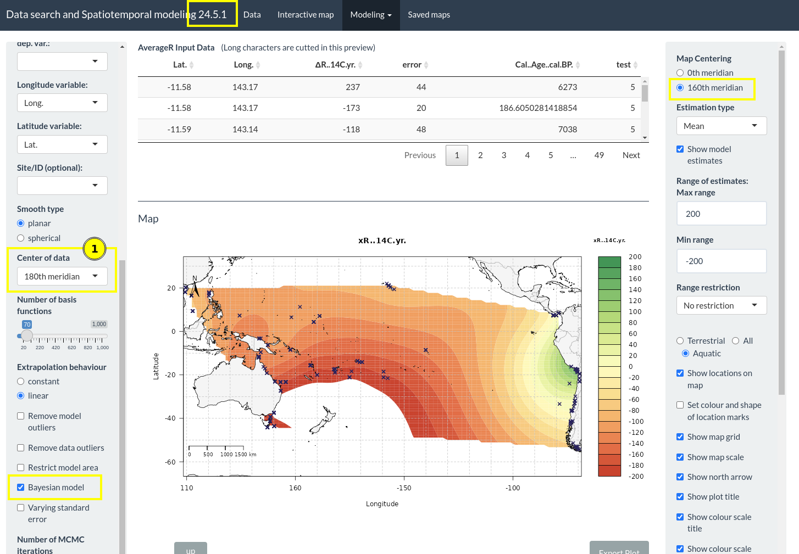
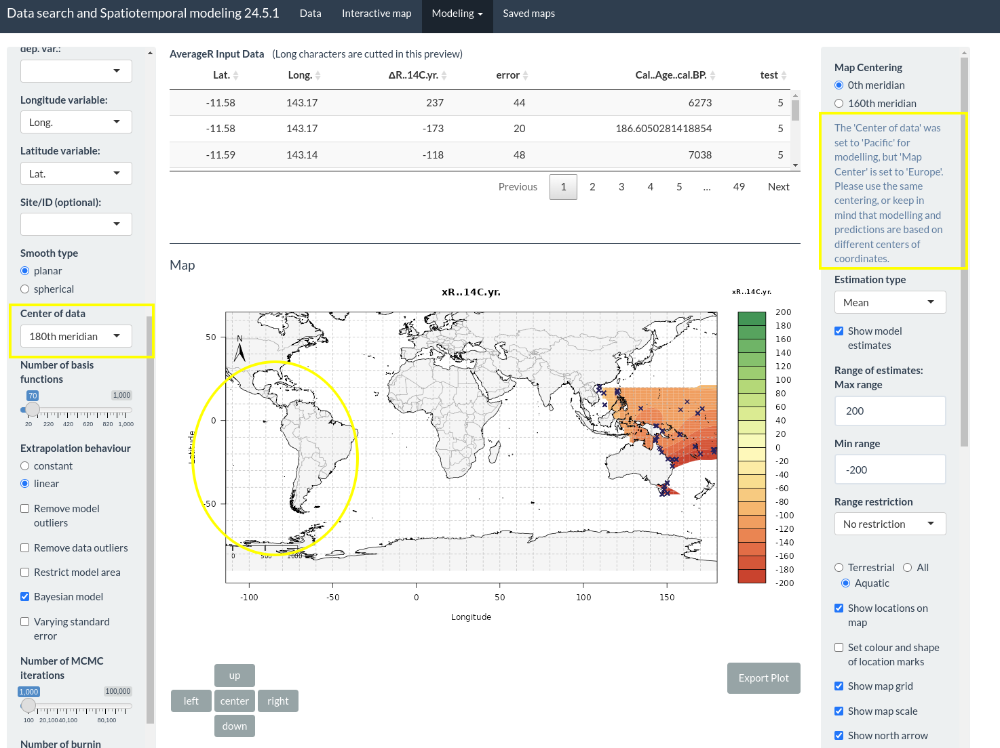
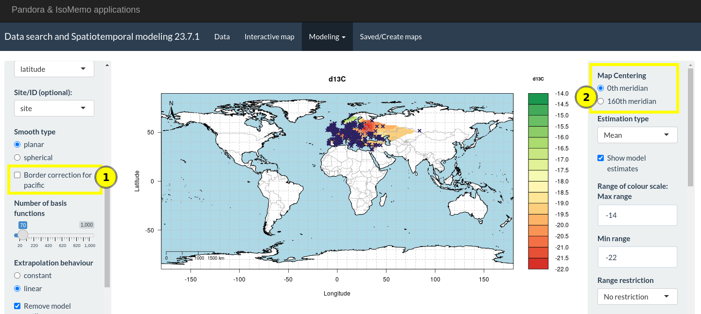
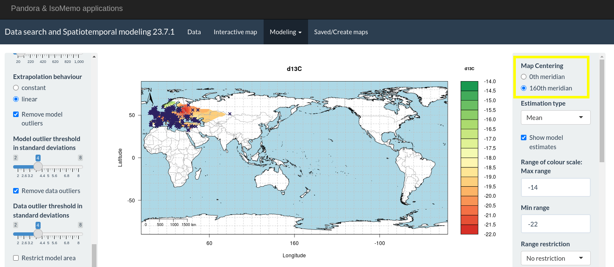

```{r, include = FALSE}
knitr::opts_chunk$set(
  collapse = TRUE,
  comment = "#>"
)
```

```{r setup, include = FALSE}
library(MpiIsoApp)
```

The different modeling tabs contain options for specifying how coordinate data can be processed. 
The following options are available:

## Select the "Smooth Type"

"Smooth type" is an option available for AverageR, TimeR and SpreadR models and allows the user to
specify whether to use a planar or a spherical model. When using a planar model, processing of the 
longitudes becomes relevant. 

## Select the "Center of data" for _planar models_

Now, the user may choose between "0th meridian" and "180th meridian" as the center of the data. 
This is important because the longitudes will be shifted to the respective center of the map before
the model run.

If selecting "0th meridian" longitudes are transposed to the range of (-180, 180) degrees, and
if selecting "180th meridian" longitudes are transposed to the range of (0, 360) degrees.

This enables the planar model to understand that e.g. data around the Pacific "belongs together" and
that the data is not on different sides of a planar map when using longitudes between (-180, 180) 
degrees for Pacific data.

```{r, echo=FALSE, fig.cap="Center of Data", out.width='650px'}

```

When setting a different center for modeling and for plotting (which includes the predictions), then
there will be a warning. Data on the west coast of South America is missing since longitudes have
been transposed to a range of (0, 360) degrees, but the plot with an Atlantic center shows the range 
of (-180, 180) degrees.

```{r, echo=FALSE, fig.cap="Warning for Centering missmatch", out.width='650px'}

```


## Use "Border correction" for a _"0th meridian" center of data_

An alternative approach to the centering of data is the border correction. This option is available
for a data center at the "0th meridian". When having data e.g. at the left and at the right border a
_planar_ model does not understand that the data is actually close to each other. This might result
in estimates that are not consistent at the borders of a map. When having data from the Pacific this 
fact becomes quite relevant. In this situation, one can apply the option for 
"border correction for pacific" (1) in order to avoid inconsistencies.

```{r, echo=FALSE, fig.cap="Border correction", out.width='650px'}

```

#### How does “border correction for pacific” work?

Starting from an Atlantic-centered map (green) we do create duplicates at each of the borders and at
the edges of the map. The duplicates contain the same data as in the original map (green). The maps
to the left and to the right (yellow) are just shifted maps. The maps above and below 
(light and dark blue) are mirrored maps. By this, data at one edge of the map will “meet” with data 
from the respective other edge of the map.

The model calculation will run on the whole “big” map (the 3x3 map) without knowing about the
borders in-between. The model does not know that data was duplicated on the 9 different sections of
the map.

This approach works perfectly fine when Bayesian modelling is _not_ used. 

```{r, echo=FALSE, fig.cap="Border correction idea", out.width='650px'}
knitr::include_graphics("../man/figures/borderCorrectionLogic.png")
```

When applying Bayesian modelling with only little data and with too few iterations, the inherent
randomness of Bayesian modelling will provide different estimates at the “inner borders” of the 
“big” map. This leads to estimates that do not match at the borders of the central (green) map, 
since we only show the central (green) map to visualize the estimates. But, this effect will 
disappear when the number of iterations is increased.

Why don’t we only shift the data? This would only catch the case if we have local data from the 
Pacific. If the data spreads along all longitudes, we still would have a border at the Atlantic. 
The above solution is more general.

For global data, the recommendation is to use “spherical” modelling where ever possible in order 
to avoid inconsistencies at the borders.

## Select "Map Centering"

"Map Centering" is an option available for all models except AssignR.

The feature to center the map at the 0th (fig. 1) or at the 160th (fig. 2) meridian just displays 
another section of the world map. We chose the 160th meridian instead of the 180th meridian to
avoid Africa and Europe to be cut at the borders of the map.

```{r, echo=FALSE, fig.cap="Map centering", out.width='650px'}

```

